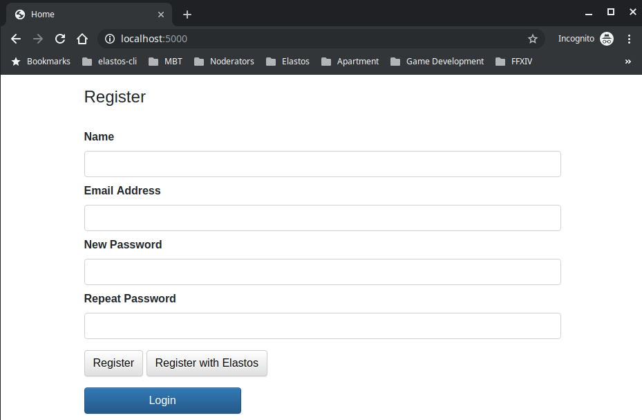
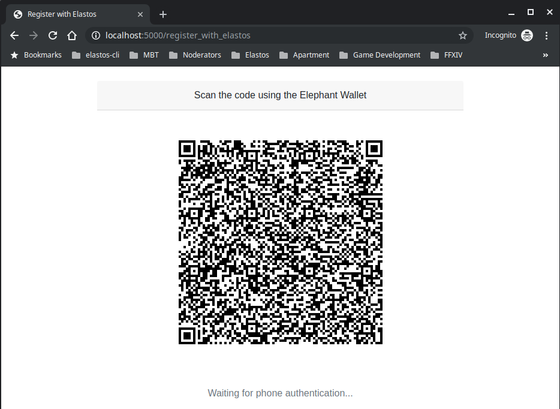
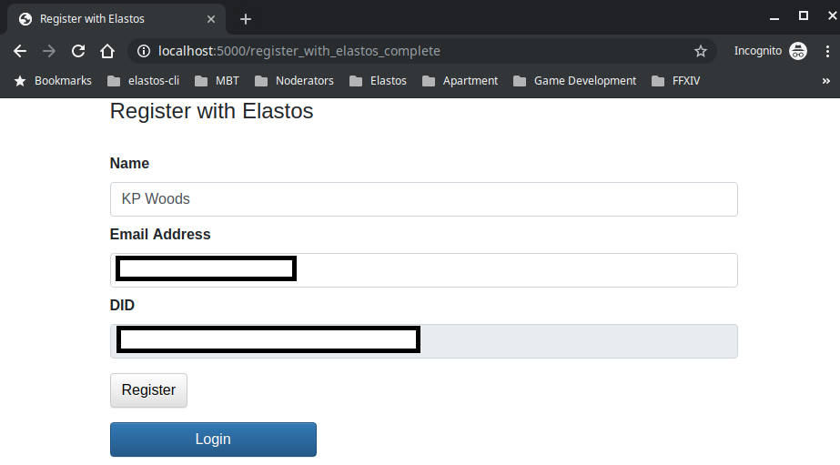
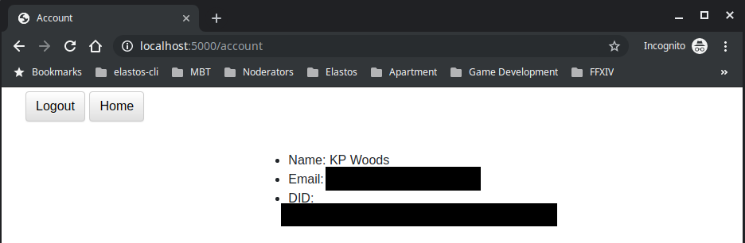

## Prerequisites
- You have registered your app on DID sidechain. If not, you can do so at [https://elastos.academy/did-wizard/](https://elastos.academy/did-wizard/)
- You have a mysql database service running. If you want to run a simple mysql database on a docker container, make sure to install docker first and then execute `docker run --name did-auth-mysql -e MYSQL_ROOT_PASSWORD=12345678 -e MYSQL_DATABASE=did-auth -p 0.0.0.0:3306:3306/tcp -d mysql:5.7`

## How to run
- `cp .env.dist didauth/.env` and edit didauth/.env to your own settings
- `pip install -t vendorlib -r requirements.txt`
- `./run.sh`
- Open "http://localhost:5000/" on your browser. The home page looks like the following:

- There are two ways to register. You can either register using traditional method, i.e. using email address and your password or you can register using Elastos. When you click on "Register with Elastos", you should see the following page:

- Now, open up your Elephant wallet on your phone and then go to your profile settings and open up your camera from the top left. The icon is a square split up with a solid line
- As soon as you scan the QR code from Elephant wallet, you should now get to the registration page that has prepopulated the required info onto the text boxes:

- Click on "Register". This will register your user to the mysql database. As soon as you click "Register", you're taken to your "Account" page that displays your profile info now retrieved from your database. This means your data was registered and saved properly

- You can also choose to logout by clicking on "Logout" from the top

## What now?
- Now that you have learned how the DID login works on a website using Elephant wallet, you can check out the python code that was used to build this website. It's written using Python Flask Framework so, you can copy paste the relevant code onto your own app and start developing! Good luck!